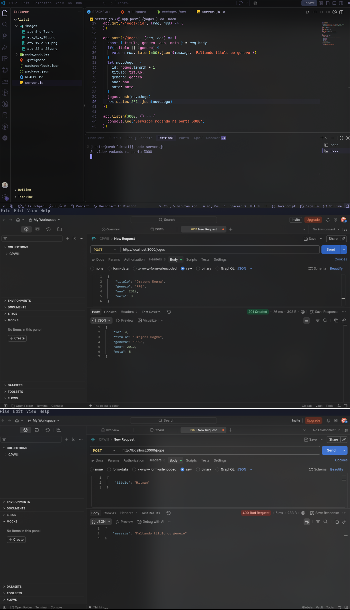
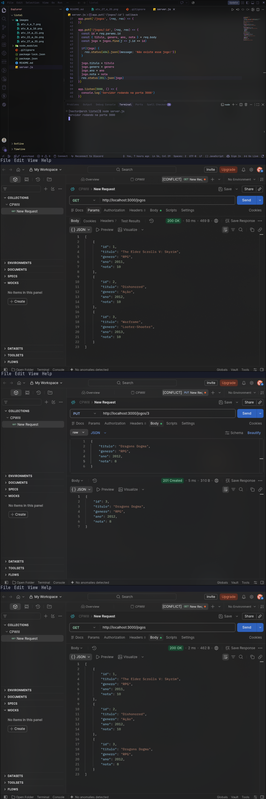
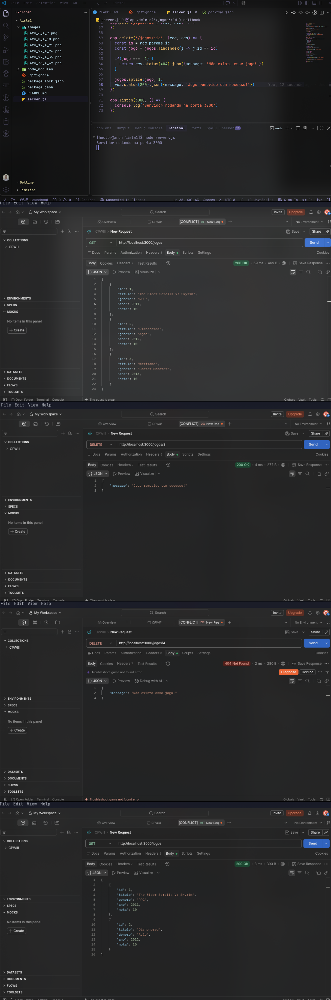
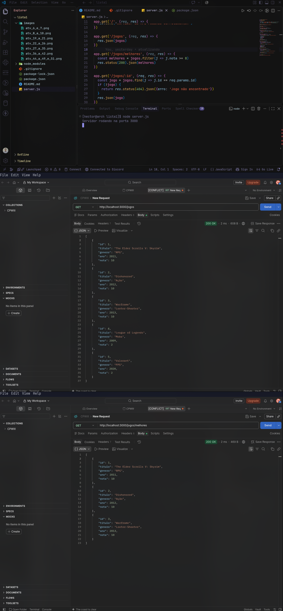
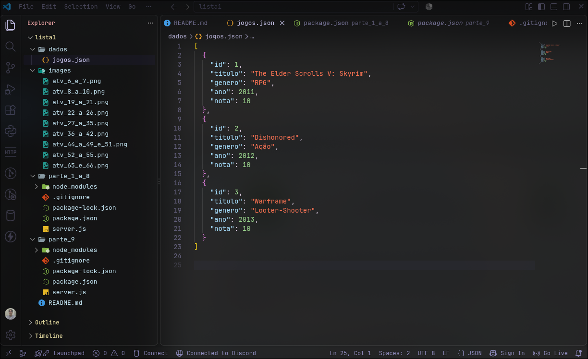


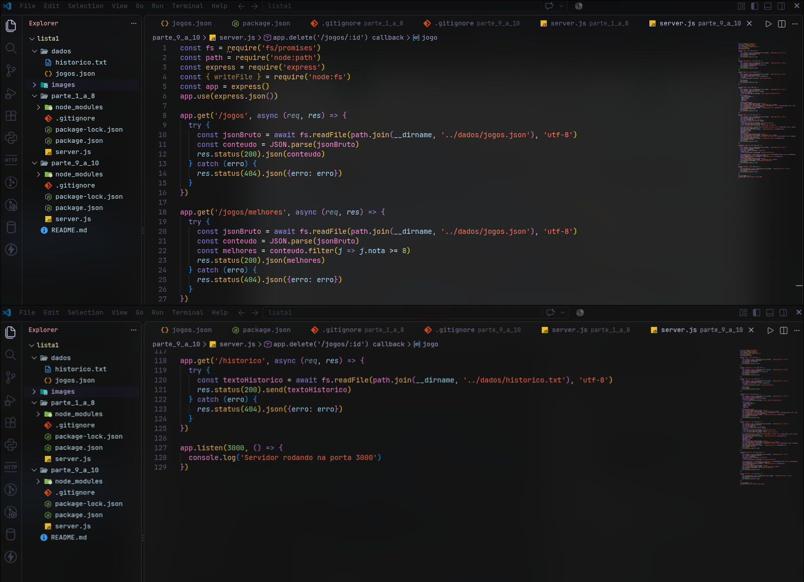
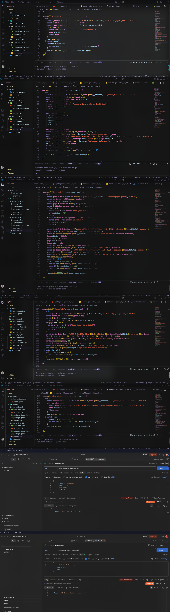

<h1 style='text-align:center; font-weight:bold'>Lista 1</h1>

> [!note]
> Para instalar as dependências do projeto faça o seguinte comando no terminal:
> 
> npm i
>
> Para rodar o servidor de o seguinte comando no terminal:
>
> node server.js

## **Parte 1 - Conceitos iniciais de Node.js, NPM e Express**

<details>
<summary style='font-size:16px; font-weight:bold'>Questões 1 a 10</summary>


### **1. Explique com suas palavras o que é Node.js e qual é sua função em uma aplicação web.**

> O Node.js permite executar JavaScript fora do navegador. Ele é usado para criar backends, APIs, acessar banco de dados e processar as informações do frontend.


### **2. Qual é a diferença principal entre executar JavaScript no navegador e executar JavaScript com Node.js?**

> Geralmente usamos o JavaScript no navegador para fazer apenas o frontend (parte visual), já fora do navegador através do Node.js para backend (APIs, banco de dados, autenticação e etc).

### **3. Explique o que é NPM.**

> É um gerenciador de pacotes do Node.js, ele serve para instalar e gerenciar bibliotecas que usamos nos projetos JavaScript.

### **4. Explique a função do arquivo package.json.**

> O arquivo package.json armazena as configurações do nosso projeto Node.js, como por exemplo as dependências que são as bibliotecas que utilizamos.

### **5. Explique por que a pasta node_modules normalmente não é enviada para o GitHub.**

> Ela não é enviada para o GitHub por conta que armazena todo o peso das dependÊncias instaladas, e tendo todas as dependências marcadas no package.json é só dar um npm i que instalara todas as dependências do projeto e criara sozinho a pasta node_modules.

### **Questões 6 e 7**
> **6. Crie um novo projeto Node.js utilizando npm init -y.**
>
> **7. Instale o Express no projeto.**


### **Questões 8 a 10**
> **8. Crie o arquivo server.js e importe/configure o Express.**
>
> **9. Configure o servidor para escutar na porta 3000.**
>
> **10. Crie a rota GET / que retorne uma mensagem informando que a API está funcionando.**


</details>

<br>

---

## **Parte 2 - Rotas, requisições e respostas**

<details>
<summary style='font-size:16px; font-weight:bold'>Questões 11 a 18</summary>

### **11. Explique o que é uma rota (endpoint) em uma API.**

> Uma rota (endpoint) é o caminho que o frontend usa para conversar com o backend permitindo enviar ou acessar dados. Exemplo: POST/formulário para enviar dados do formulário para o backend verificar, tratar ou salvar.

### **12. Explique a função de req em uma rota Express.**

> O req abreviação para request ou requisição, é a requisição de algo que o cliente enviou para o servidor. Por exemplo o cliente está fazendo login em sua conta, ele envia seu email e senha como requisição pro servidor analisar.

### **13. Explique a função de res em uma rota Express.**

> O res abreviação para response ou resposta, é a resposta que o servidor está enviado para a requisição que o cliente tinha feito para o servidor. Como no exemplo do req, em que a pessoa enviou o email e senha para o login, se o email e a senha estiverem certos o servidor responde logado "com sucesso", já se o email ou senha estiverem incorretos, o servidor responde "email ou senha incorretos".

### **14. Explique a diferença entre res.send() e res.json().**

> **res.send():** envia uma resposta em formato de texto.
>
> **res.json():** enviar uma resposta no formato especifico JSON.

### **15. Explique o significado de API REST ou RESTful dentro do conteúdo trabalhado.**

> API REST ou RESTful é uma API que padroniza regras para organizar a comunicação entre cliente e servidor, usando HTTP com os métodos CRUD -> Create (POST -> cria dados), Read (GET -> busca dados), Update (PUT/PATCH -> atualiza dados) e Delete (DELETE -> exclui/apaga/deleta dados).

### **16. Associe cada método HTTP à sua finalidade: GET, POST, PUT e DELETE.**

> **GET:** é o R do CRUD, Read responsável por buscar dados;
>
> **POST:** é o C do CRUD, Create responsável por criar dados;
>
> **PUT:** é o U do CRUD, Update responsável por atualizar dados;
>
> **DELETE:** é o D do CRUD, Delete responsável por excluir/apagar/deletar dados.

### **17. Explique a diferença entre req.body e req.params.**

> **req.body:** pega os dados que o cliente enviou no corpo da requisição. Exemplo abaixo:
```js
app.post('/login', (req, res) => {
  const { email, senha } = req.body
})
```
> No exemplo abaixo é o corpo da requisição que volta como um JSON, passando o email e senha do usuário, o código acima pega esse email e senha, então pode fazer algo com eles.
```json
{
  "email": "tucunarelson@peixes.com",
  "senha": "><(((°>"
}
```
> **req.params:** pega os dados que foram enviados na URL. Exemplo abaixo:
```js
app.get('/livro/:id', (req, res) => {
  const id = req.params.id
})
```
> No exemplo abaixo se passa /livro/1, 1 é o id do código acima, então o código acima pega esse dado e pode fazer alguma coisa com ele.
```
http://localhost:3000/livro/1
```

### **18. Explique para que serve app.use(express.json()).**

> Serve para fazer o Express entender dados enviados em JSON no corpo das requisições com req.body. Exemplo:
```js
const express = require('express')
const app = express()
app.use(express.json())

app.post('/login', (req, res) => {
  const { email, senha } = req.body
})
```
> Os dados que o cliente enviar pelo frontend sempre serão enviados para o backend no formato JSON. Assim:
```json
{
  "email": "tambaquilson@peixes.com",
  "senha": "><(((°>" 
}
```
> Para o backend traduzir esses dados e conseguir tratar os dados corretamente é necessário o app.use(express.json()).

</details>

<br>

---

## **Parte 3: Estrutura inicial de dados**

<details>
<summary style='font-size:16px; font-weight:bold'>Questões 19 a 26</summary>


### **Questões 19 a 21**
> **19. Crie inicialmente um array chamado jogos contendo pelo menos 3 objetos.**
>
> **20. Crie GET /jogos para retornar todos os jogos.**
>
> **21. Teste GET /jogos no Postman.**


### **Questões 22 a 26**
> **22. Crie GET /jogos/:id para buscar apenas um jogo pelo ID.**
>
> **23. Utilize req.params.id para capturar o ID informado na URL.**
>
> **24. Utilize find() para localizar o jogo.**
>
> **25. Caso o jogo não exista, retorne status 404 e uma mensagem em JSON.**
>
> **26. Teste no Postman um ID existente e um ID inexistente.**


</details>

<br>

---

## **Parte 4 - POST: Criação de dados**

<details>
<summary style='font-size:16px; font-weight:bold'> Questões 27 a 35</summary>

### **Questões 27, 29 a 33**
> **27. Crie POST /jogos para cadastrar um novo jogo.**
>
> **28. O body deverá ser enviado pelo Postman no formato JSON. Exemplo: {"titulo":"Minecraft","genero":"Aventura","ano":2011,"nota":9}**
>
> **29. Capture os dados utilizando req.body.**
>
> **30. Crie o ID do novo jogo automaticamente.**
>
> **31.Adicione o novo objeto ao array utilizando push().**
>
> **32. Caso titulo ou genero não sejam enviados, retorne status 400.**
>
> **33. Quando o cadastro for realizado corretamente, utilize status 201**
>
> **34. Teste no Postman um POST válido.**
>
> **35. Teste no Postman com dados obrigatórios ausentes.**



</details>

<br>

---

## **Parte 5 - PUT: atualização de dados**

<details>
<summary style='font-size:16px; font-weight:bold'>Questões 36 a 43</summary>

### **Questões 36 a 42**
> **36. Crie PUT /jogos/:id**
>
> **37. Localize o jogo utilizando o ID recebido por req.params.**
>
> **38. Permita alterar titulo, genero, ano e nota por meio do Body JSON.**
>
> **39. Caso o jogo não exista, retorne status 404.**
>
> **40. Retorne o objeto atualizado após a alteração.**
>
> **41. Teste no Postman uma atualização válida.**
>
> **42. Teste uma tentativa de atualização utilizando um ID inexistente.**



### **43. Explique por que o PUT é diferente do POST.**

> **POST:** é usado para criar dados novos;
>
> **PUT:** é usado para atualizar ou substituir um dado que já existe.

</details>

<br>

---

## **Parte 6 - DELETE: exclusão de dados**

<details>
<summary style='font-size:16px; font-weight:bold'>Questões 44 a 49 e 51</summary>

### **Questões 44 a 49 e 51**
> **44. Crie DELETE /jogos/:id**
>
> **45. Utilize findIndex() para localizar a posição do jgo no array.**
>
> **46. Utilize splice() para remover o jogo.**
>
> **47. Caso o ID não exista, retorne status 404.**
>
> **48. Retorne uma mensagem confimando a exclusão.**
>
> **49. Teste o DELETE no Postman.**
>
> **51. Depois da exclusão, faça um GET /jogos e comprove que o item foi removido.**



### **50. Explique por que, neste caso, o DELETE não precisa receber Body.**

> Porque já estamos passando o id do jogo que queremos excluir pela URL e capturamos ele com req.params.

</details>

<br>

---

## **Parte 7 - Rota especial e manipulação de arrays**

<details>
<summary style='font-size:16px; font-weight:bold'>Questões 52 a 57</summary>

### **Questões 52 a 54**
> **52. Crie GET /jogos/melhores.**
>
> **53. Essa rota deverá retornar apenas jogos com a nota maior ou igual a 8.**
>
> **54. Utilize filter() para realizar a seleção.**
>
> **55. Teste a rota no Postman.**



### **56. Explique a diferença entre find(), findIndex() e filter().**

> **find():** acha o primeiro item encontrado. Exemplo:
```js
const jogos = [{id: 1, nome: 'Baldurs Gate 3'}, {id: 2, nome: 'Baldurs Gate 3'}]

app.get('/jogos', (req, res) => {
  const jogo = jogos.find(j => j.nome == 'Baldurs Gate 3')
  if(!jogo) {
    res.status(404).json({message: 'Esse jogo não existe!'})
  }
  res.status(200).json(jogo)
})
```
> No exemplo acima existem dois jogos com o mesmo nome, então o json retornaria o primeiro apenas. Assim:
```json
{
  "id": 1,
  "nome": "Baldurs Gate 3"
}
```

> **findIndex():** acha a posição em que o item está. Exemplo:
```
URL passada: http://localhost:3000/jogos/2
```
```js
const jogos = [{id: 1, nome: 'Baldurs Gate 3'}, {id: 2, nome: 'No Mans Sky'}]

app.delete('/jogos/:id', (req, res) => {
  const jogo = jogos.findIndex(j => j.id == req.params.id)
  if(jogo === -1) {
    res.status(404).json({message: 'Esse jogo não existe!'})
  }
  jogos.splice(jogo)
  res.status(200).json({message: 'Jogo excluido com sucesso!'})
})
```
> No exemplo acima pegamos a posição no array em que se encontar o objeto que possui o id 2, então excluimos o que existe nessa posição do array.

> **filter():** acha todos os items que atendem a condição e volta como um array.
```js
const jogos = [{id: 1, nome: 'Baldurs Gate 3'}, {id: 2, nome: 'Baldurs Gate 3'}]

app.get('/jogos', (req, res) => {
  const jogo = jogos.filter(j => j.nome == 'Baldurs Gate 3')
  if(!jogo) {
    res.status(404).json({message: 'Esse jogo não existe!'})
  }
  res.status(200).json(jogo)
})
```
> No exemplo acima temos dois jogos com o mesmo nome que passam na verificação, então o json retornaria uma lista com os dois objetos. Assim:
```json
[
  {
    "id": 1,
    "nome": "Baldurs Gate 3"
  },
  {
    "id": 2,
    "nome": "Baldurs Gate 3"
  }
]
```

### **57. Explique a diferença entre push() e splice().**

> **push():** adiciona um item ao final da lista. Exemplo:
```js
const lista = [1, 2, 3]
lista.push(4)
console.log(lista)
// log retornaria [1, 2, 3, 4]
```

> **splice:** remove um ou mais itens de uma lista. Exemplo:
```js
const lista = ['Sherek 1', 'Sherek 2', 'Sherek 3']
lista.splice(1, 1)
console.log(lista)
// log retornaria ['Sherek 1', 'Sherek 3'] removendo apenas a posição 1 do array

const lista = ['Sherek 1', 'Sherek 2', 'Sherek 3']
lista.splice(0, 2)
console.log(lista)
// log retornaria ['Sherek 3'] removendo da posição 0 até a 1 pois colocamos para remover 2 itens
```

</details>

<br>

---

## **Parte 8 - JSON: teoria e conversão**

<details>
<summary style='font-size:16px; font-weight:bold'>Questões 58 a 64</summary>

### **58. Explique o que é JSON.**

> É um formato usado para padronizar como os dados serão enviados entre sistemas, utilizado em toda a internet.

### **59. Explique a função de JSON.parse().**

> Serve para transformar uma string em um objeto, importante que o texto seja arrumado para ficar igual a um JSON. Exemplo:
```js
let texto = '{"nome": "tambaquilson", "raca": "peixe"}'
let tambaquilson = JSON.parse(texto)
console.log(tambaquilson)
// esse log retornaria o objeto {nome: 'tambaquilson', raca: 'peixe'}

console.log(tambaquilson.nome)
// esse log retornaria "tambaquilson"
```

### **60. Explique a função de JSON.stringify().**

> Serve para transformar um objeto em uma string formatada como json. Exemplo:
```js
let objeto = {nome: 'tambaquilson', raca: 'peixe'}
let texto = JSON.stringify(objeto)
console.log(texto)
// o log retornaria {"nome": "tambaquilson", "raca": "peixe"}
```

### **61. Explique por que um arquivo JSON armazenado no disco precisa ser lido como texto antes de ser manipulado com objeto/array JavaScript.**

> Porque o arquivo .json é armazenado no disco como texto. O JavaScript não consegue manipular ele diretamente como um objeto ou array, então é necessario usar um JSON.parse() para transfomalo em objeto.

### **62. Explique a finalidade dos parâmetros null, 2 em JSON.stringify(dados, null, 2).**

> **null:** serve para não fazer nenhuma transformação nos dados.
>
> **2:** defie 2 espaços de identação, deixando o JSON organizado e fácil de ler.

### **63. Identifique pelo menos três regras de sintaxe de um JSON válido.**

> **1º regra:** chaves e valores devem estar entre aspas duplas a não ser que o valor seja diferente de uma string.
```json
{"nome": "tucunarelson"}
```

> **2º regra:** chave e valor são separados por dois pontos (:).
```json
{"idade": 333}
```

> **3º regra:** conjuto de chave e valor são separados por virgula (,).
```json
{"nome": "tilapiton", "idade": 67}
```

### **64. Explique a diferença entre um objeto JavaScript em memória e o texto armazenado em um arquivo .json.**

> A diferença é como os dados são armazenados. Em objeto está sendo diretamente usado pelo programa e pode ser manipulado pelo JavaScript. Já em .json armazena os dados em texto fixo.

</details>

<br>

---

## **Parte 9 - Persistência em arquivo JSON**

<details>
<summary style='font-size:16px; font-weight:bold'>Questões 65 a 75</summary>

### **Questões 65 e 66**
> **65. Crie uma pasta dados e, dentro dela, o arquivo jogos.json.**
>
> **66. Transfira os jogos iniciais para jogos.json.**



### **Questões 67 a 71 e 73 a 75**
> **67. Leia o conteúdo de jogos.json utilizando o módulo fs.**
>
> **68. Converta o conteúdo lido utilizando JSON.parse().**
>
> **69. Faça GET /jogos retornar os dados lidos do arquivo, em vez de depender somente de um array criado diretamente no server.js.**
>
> **70. No POST /jogos, leia o arquivo, faça JSON.parse(), adicione o novo jogo com push(), converta novamente com JSON.stringify() e grave o arquivo.**
>
> **71. Depois de cadastrar um jogo pelo Postman, reinicie o servidor e comprove que o jogo continua cadastrado.**
>
> **73. Adapte o PUT para que a alteração também seja salva em jogos.json.**
>
> **74. Adapte o DELETE para que a exclusão também seja salva em jogos.json.**
>
> **75. Teste novamente GET, POST, PUT e DELETE no Postman após implementar a persistência.**



### **72. Explique por que os dados agora permanecem após o servidor ser desligado.**

> Porque toda vez que faz um POST lemos o arquivo e depois reescreve ele com as alterações, tanto pro PUT e DELETE, quando atualiza os dados reescrevemos todo o arquivo de novo com as alterações e quando exluimos acontece o mesmo, e como sempre lemos esse mesmo arquivo as alterações sempre serão definitivas independente de reiniciar o servidor.

</details>

<br>

---

## **Parte 10 - Manipulação de arquivo TXT e histórico**

<details>
<summary style='font-size:16px; font-weight:bold'>Questões 76 a 85</summary>

### **Questões 76 a 82**
> **76. Crie o arquivo histórico.txt.**
>
> **77. Sempre que um jogo for cadastrado, acrescente uma linha no histórico. Formato sugerido: JOGO CADASTRADO: Minecraft**
>
> **78. Sempre que um jogo for atualizado, acrescente uma linha informando a atualização.**
>
> **79. Sempre que um jogo for removido, acrescente uma linha informando a remoção.**
>
> **80. Utilize appendFile ou appendFileSync para acrescentar dados sem apagar o conteúdo anterior.**
>
> **81. Crie GET /historico para ler e retornar o conteúdo de histórico.txt.**
>
> **82. Teste GET /historico no Postman.**

 

### **83. Explique a diferença entre writeFile e appendFile.**

> O writeFile escreve um arquivo inteiro, já o appendFile apenas adiciona o texto ao final de um arquivo já existente.

### **84. Explique o que pode acontecer com o conteúdo anterior de um arquivo quando writeFile é utilizado sobre um arquivo que já existe.**

> Quando usa writeFile em um arquivo que já existe perde todo o conteudo dentro, o arquivo inteiro é reescrito.

### **85. Explique a finalidade de um readFile.**

> É readFIle é necessario para ler o conteudo de um arquivo de armazenalo em uma variavel para depois convertela em objeto com o JSON.parse() para poder manipular o conteudo que estava no arquivo.

</details>

<br>

---

## **Parte 11 - Exclusão de arquivos e módulo fs**

<details>
<summary style='font-size:16px; font-weight:bold'>Questões 86 a 90</summary>

### **86. Explique a função de fs.unlink()**

> O fs.unlink() serve para excluir um arquivo do disco.

### **87. Explique o que acontece quando fs.unlink() é usado para remover um arquivo.**

> O arquivo é apagado do disco, impossibilitando a leitura dele através do readFile.

### **88. Associe as operações abaixo aos métodos de arquivos correspondentes: criar/escrever, ler, acrescentar e excluir.**

> **criar/escrever** -> fs.writeFile() -> CREATE do CRUD;
>
> **ler** -> fs.readFile() -> READ do CRUD;
>
> **acrescentar** -> fs.appendFile() -> UPDATE do CRUD;
>
> **excluir** -> fs.unlink() -> DELETE do CRUD.

### **89. Explique o que significa o erro ENOENT.**

> ENOENT é quando o sistema não encontrou o arquivo ou diretório que passou para a função.

### **90. Cite uma situação do projeto em que ENOENT poderia ocorrer.**

> Ao tentar exluir um arquivo com fs.unlink() mas o arquivo não existe, ou não passou o caminho completo e está tentando acessar outro diretório em que o arquivo não existe.

</details>

<br>

---

## **Parte 12 - path e caminhos de arquivos**

<details>
<summary style='font-size:16px; font-weight:bold'>Questões 91 a 95</summary>

### **91. Explique para que serve o módulo path do Node.js.**

> Serve para acessar caminho de arquivos e pastas de forma facilitada, por exemplo com path.join(__dirname, 'arquivo') acessa a pasta atual e concatena com o restante do caminho para o arquivo que quer.

### **92. Explique por que escrever caminhos manualmente pode causar problemas entrer Windows, Linux e macOS.**

> Porque cada sistema operacional usa um formato diferente de caminho, então se passar escrito o caminho para windows o código não vai funcionar pra Linux nem para macOS porque o caminho vai ser totalmente diferente. Com o path.join(__dirname, 'arquivo') corrige esse problema porque pega o caminho se adaptando ao sistema.

### **Questões 93 e 94**
> **93. Utilize path.join() para montar o caminho de jogos.json.**
>
> **94. Utilize path.join() para montar o caminho de historico.txt**



### **95. Explique a vantagem de utilizar path.join() no projeto.**

> A vantagem é montar caminhos de arquivos e pastas de forma compativel com qualquer sistema operacional.

</details>

<br>

---

## **Parte 13 - Tratamento de erros**

<details>
<summary style='font-size:16px; font-weight:bold'>Questões 96 a 100</summary>

### **96. Explique a função do bloco try/catch.**

> Servem para tratar erros que podem acontecer durante a execução do código, try -> tente fazer isso, catch -> caso de errado faça tal coisa.

### **Questões 97 a 100**
> **97. Implemente tratamento de erro em pelo menos uma operação de leitura de arquivo.**
>
> **98. Implemente tratamento de erro em pelo menos uma operação escrita de arquivo.**
>
> **99. Caso ocorra um erro interno inesperado em uma rota, retorne uma resposta de erro apropriada ao cliente.**
>
> **100. Teste uma situação de erro controlado e descreva no README o que aconteceu.**



> Nas duas ultimas fotos acima, testei colocar um id inexistente onde o catch capturou o erro 404 e devolveu que o jogo não existia, e no outro deixei um campo obrigatório sem preencher no body e o catch capturou o erro 400 e devolveu a mensagem para preencher os campos obrigatórios.

</details>

<br>

---

## **Parte 14 - Síncrono, assíncrono e Event Loop**

<details>
<summary style='font-size:16px; font-weight:bold'>Questões 101 a 108</summary>

### **101. Explique a diferença entre uma operação síncrona e uma operação assíncrona.**

> Uma operação síncrona executa uma tarefa e espera ela terminar antes de continuar. Já uma operação assíncrona inicia uma tarefa que pode levar algum tempo e permite que o programa continue executando outras coisas enquanto espera o resultado.

### **102. Explique o que acontece com o servidor quando uma operação síncrona demorada bloqueia a execução.**

> O processo principal fica esperando a operação terminar, enquanto isso o servidor não consegue executar outras operações.

### **103. Explique, de acordo com o conteúdo trabalhado, por que operações assíncronas são preferíveis em rotas de servidor.**

> Porque em um servidor varias pessoas podem estar usando diversos de suas operações. Então se fosse síncrono toda vez que uma pessoa fosse fazer algo com o servidor, todos os outros teriam que esperar para poderem usar, não faria sentido. O assíncrono permite que usem varias operações ao mesmo tempo, sem inutilizar o servidor.

### **104. Explique o que é uma Promise.**

> Promisse é uma promessa de que uma operação assíncrona vai fornecer um resultado no futuro, dando sucesso ou erro.

### **105. Explique a função de async.**

> Torna uma função assíncrona permitindo que a operação não trave o servidor e que a função possa usar await.

### **106. Explique a função de await.**

> O await espera uma promisse terminar para obter o resultado dela antes de continuar a execução do restante da função.

### **107. Compare readFileSync com readFile.**

> A diferença é que readFileSync() é como se usassemos await readFile(), ela é síncrona só continua com a execução depois de obter o resultado dela. Já readFIle() é assíncrona da para usar um await para esperar o resultado da promisse sem comprometer o servidor. 

### **108. Se utilizar a versão assíncrona no projeto, envolva a operação em try/catch.**

- [x] Usar try/catch com o projeto assíncrono

</details>

<br>

---

## **Parte 15 - Middlewares**

<details>
<summary style='font-size:16px; font-weight:bold'>Questões 109 a 112</summary>

### **109. Explique o que é um middleware no Express.**

> É uma função que fica no meio do caminho entre a requisição do cliente e a resposta do servidor. Ele pode analisar ou modificar a requisição, executar alguma operação e depois permitir que o processamento continue ou não.

### **110. Explique por que express.json() pode ser considerado um middleware.**

> Porque ele retorna uma função que o Express executa durante o processamento de cada requisição para conseguir ler JSON.

### **111. Cite duas responsabilidades que o middleware pode assumir em uma aplicação.**

> **Autenticação e autorização:** vai verificar se o usuário está autenticado e se possui permissão para acessar determinada rota ou operação.
>
> **Validação de dados:** vai verificar se os dados enviados pelo cliente estão corretos.

### **112. Explique em que momento o middleware atua no fluxo requisição -> rota -> resposta.**

> O middleware atua depois que a requisição chega no servidor e antes que ela chegue na rota que vai gerar a resposta. requisição -> middleware -> rota -> resposta.

</details>

<br>

---

## **Parte 16 - Sessões e Cookies - SOMENTE TEORIA**

<details>
<summary style='font-size:16px; font-weight:bold'>Questões 113 a 121</summary>

### **113. Explique por que o protocolo HTTP é considerado stateless.**

> Porque cada requisição é tratada de forma independente. O servidor, por padrão, não precisa guardar informações sobre as requisições anteriores do cliente.

### **114. Explique o que é um Cookie.**

> É uma pequena informação que o servidor pode enviar para o navegador, e o navegador armazena-lo e envia-lo novamente em requisições futuras para o site. Geralmente salva questões de aparencia nenhum dado sensivel.

### **115. Explique o que é uma Sessão.**

> É a forma de o servidor manter informações sobre um usuário entre várias requisições HTTP, armazenando dados do usuario, mantendo estado do usuario mesmo que o HTTP seja stateless.

### **116. Onde os dados de um Cookie ficam armazenados?**

> Os dados ficam armazenados no navegado do usuário, no dispositvo que está acessando o site.

### **117. Onde os dados de uma Sessão ficam armazenados?**

> Os dados ficam armazenados no servidor so site, e não no navegador. O navegador guarda apenas o ID da sessão pelo cookie, pois a sessão armazena dados sensiveis.

### **118. Explique como Cookie e Sessão podem trabalhar juntos para conhecer um usuário entre diferentes requisições.**

> A sessão guarda os dados do usuário no servidor, enquanto o cookie guarda no navegador o id que permite encontrar a sessão do usuário.

### **119. Cite um exemplo de uso adequado para Cookie.**

> Armazenar preferencias visuais do usuario, como modo escuro ou claro.

### **120. Cite um exemplo de uso adequado para Sessão.**

> Manter um usuário autenticado enquanto ele navega por um sistema.

### **121. Explique, de forma conceitual, o que é Session ID.**

> É um valor único usado pelo servidor para identificar uma determinada sessão de um usuário. O navegador recebe o Session ID em um Cookie, nas próximas requisições, ele envia esse mesmo Session ID novamente.

</details>

<br>

---

## **Parte 17 - Testes obrigatórios no Postman**

<details>
<summary style='font-size:16px; font-weight:bold'>Questões 122 a 135</summary>

- [x] **122. Crie no Postman uma requisição para GET /.**
- [x] **123. Crie uma requisição para GET /jogos.**
- [x] **124. Crie uma requisição para GET /jogos/:id.**
- [x] **125. Crie uma requisição para POST /jogos com Body JSON.**
- [x] **126. Crie uma requisição para PUT /jogos/:id com Body JSON.**
- [x] **127. Crie uma requisição para DELETE /jogos/:id.**
- [x] **128. Crie uma requisição para GET /jogos/melhores.**
- [x] **129. Crie uma requisição para GET /historico.**
- [x] **130. Para cada operação principal, registre no README pelo menos um pront que mostre a execução.**
- [x] **131. Em POST e PUT, o print deverá mostrar o Body JSON utilizado.**
- [x] **132. Inclua pelo menos um teste que resulte em status 404.** 
- [x] **133. Inclua pelo menos um teste que resulte em status 400.**
- [x] **134. Inclua pelo menos um teste que resulte em status 201.**
- [x] **135. Não será considerado suficiente entregar apenas o código sem evidência de execução das rotas.**

</details>

<br>

---

## **Parte 18 - Organização e entrega**

<details>
<summary style='font-size:16px; font-weight:bold'>Questões 136 a 141</summary>

- [x] **136. Organize o projeto de forma clara, separando os arquivos de dados do arquivo principal do servidor.**

  Estrutura mínima sugerida:<br>
  server.js<br>
  package.json<br>
  dados/jogos.json<br>
  dados/historico.txt<br>
  README.md
- [x] **137. Não envie a pasta node_modules para o repositório.**
- [x] **138. Inclua no README os comandos necessários para instalar as dependências e iniciar o servidor.**
- [x] **139. Inclua no README as respostas das questões teóricas.**
- [x] **140. Inclua no README os prints solicitados dos testes no Postman.**
- [x] **141. Envie o link do repositório no GitHub conforme orientação da professora.**

</details>


<br>

---