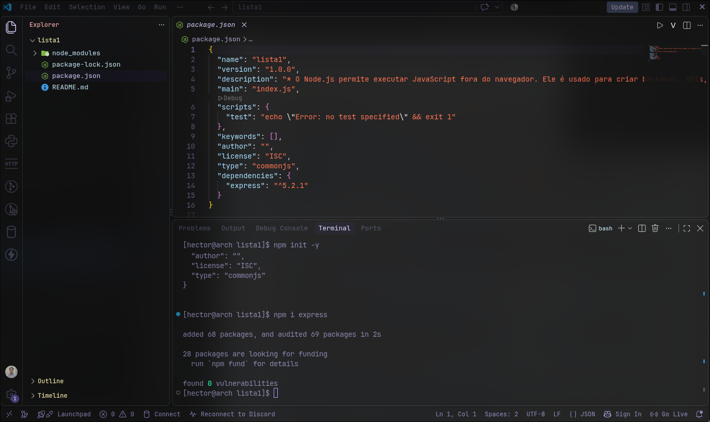
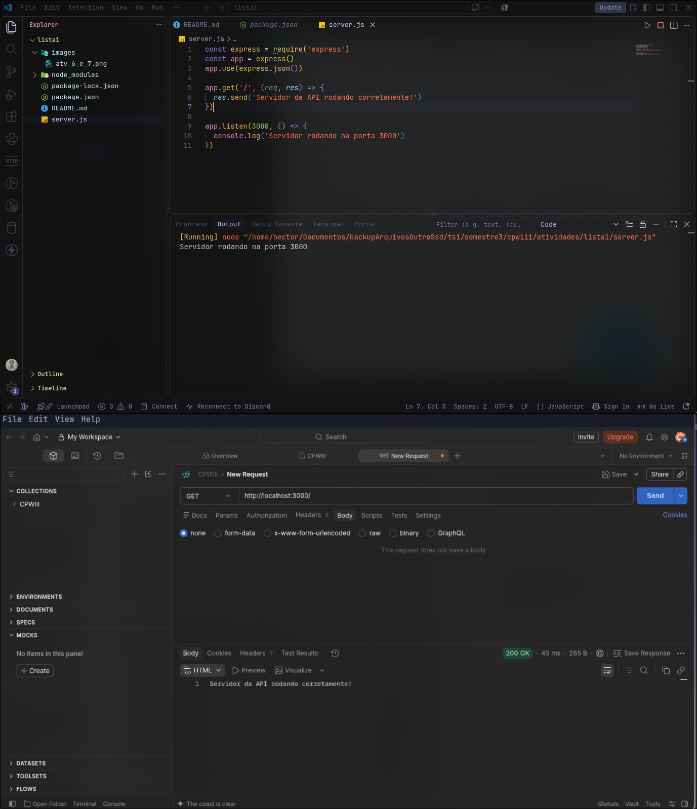
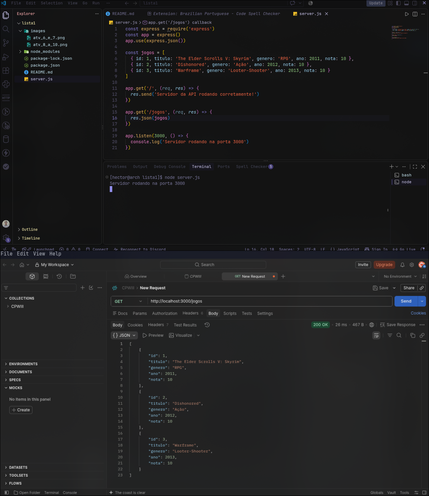
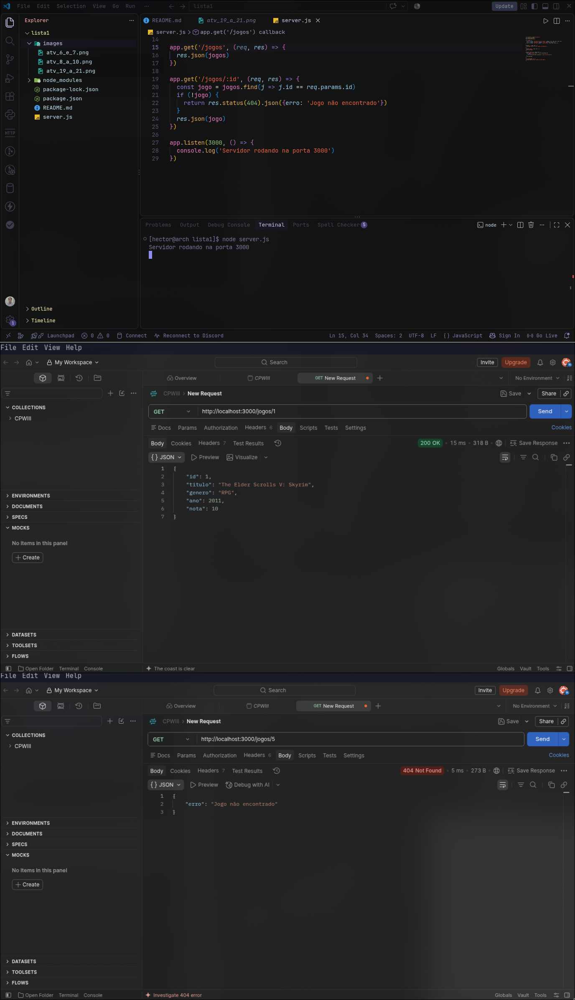

<h1 style='text-align:center; font-weight:bold'>Lista 1</h1>

## **Parte 1 - Conceitos iniciais de Node.js, NPM e Express**

<details>
<summary style='font-size:16px; font-weight:bold'>Questões 1 a 10</summary>


### **1. Explique com suas palavras o que é Node.js e qual é sua função em uma aplicação web.**

> O Node.js permite executar JavaScript fora do navegador. Ele é usado para criar backends, APIs, acessar banco de dados e processar as informações do frontend.


### **2. Qual é a diferença principal entre executar JavaScript no navegador e executar JavaScript com Node.js?**

> Geralmente usamos o JavaScript no navegador para fazer apenas o frontend (parte visual), já fora do navegador através do Node.js para backend (APIs, banco de dados, autenticação e etc).

### **3. Explique o que é NPM.**

> É um gerenciador de pacotes do Node.js, ele serve para instalar e gerenciar bibliotecas que usamos nos projetos JavaScript.

### **4. Explique a função do arquivo package.json.**

> O arquivo package.json armazena as configurações do nosso projeto Node.js, como por exemplo as dependências que são as bibliotecas que utilizamos.

### **5. Explique por que a pasta node_modules normalmente não é enviada para o GitHub.**

> Ela não é enviada para o GitHub por conta que armazena todo o peso das dependÊncias instaladas, e tendo todas as dependências marcadas no package.json é só dar um npm i que instalara todas as dependências do projeto e criara sozinho a pasta node_modules.

### **Questões 6 e 7**
> **6. Crie um novo projeto Node.js utilizando npm init -y.**
>
> **7. Instale o Express no projeto.**



### **Questões 8 a 10**
> **8. Crie o arquivo server.js e importe/configure o Express.**
>
> **9. Configure o servidor para escutar na porta 3000.**
>
> **10. Crie a rota GET / que retorne uma mensagem informando que a API está funcionando.**



</details>

<br>

---

## **Parte 2 - Rotas, requisições e respostas**

<details>
<summary style='font-size:16px; font-weight:bold'>Questões 11 a 18</summary>

### **11. Explique o que é uma rota (endpoint) em uma API.**

> Uma rota (endpoint) é o caminho que o frontend usa para conversar com o backend permitindo enviar ou acessar dados. Exemplo: POST/formulário para enviar dados do formulário para o backend verificar, tratar ou salvar.

### **12. Explique a função de req em uma rota Express.**

> O req abreviação para request ou requisição, é a requisição de algo que o cliente enviou para o servidor. Por exemplo o cliente está fazendo login em sua conta, ele envia seu email e senha como requisição pro servidor analisar.

### **13. Explique a função de res em uma rota Express.**

> O res abreviação para response ou resposta, é a resposta que o servidor está enviado para a requisição que o cliente tinha feito para o servidor. Como no exemplo do req, em que a pessoa enviou o email e senha para o login, se o email e a senha estiverem certos o servidor responde logado "com sucesso", já se o email ou senha estiverem incorretos, o servidor responde "email ou senha incorretos".

### **14. Explique a diferença entre res.send() e res.json().**

> **res.send():** envia uma resposta em formato de texto.
>
> **res.json():** enviar uma resposta no formato especifico JSON.

### **15. Explique o significado de API REST ou RESTful dentro do conteúdo trabalhado.**

> API REST ou RESTful é uma API que padroniza regras para organizar a comunicação entre cliente e servidor, usando HTTP com os métodos CRUD -> Create (POST -> cria dados), Read (GET -> busca dados), Update (PUT/PATCH -> atualiza dados) e Delete (DELETE -> exclui/apaga/deleta dados).

### **16. Associe cada método HTTP à sua finalidade: GET, POST, PUT e DELETE.**

> **GET:** é o R do CRUD, Read responsável por buscar dados;
>
> **POST:** é o C do CRUD, Create responsável por criar dados;
>
> **PUT:** é o U do CRUD, Update responsável por atualizar dados;
>
> **DELETE:** é o D do CRUD, Delete responsável por excluir/apagar/deletar dados.

### **17. Explique a diferença entre req.body e req.params.**

> **req.body:** pega os dados que o cliente enviou no corpo da requisição. Exemplo abaixo:
```js
app.post('/login', (req, res) => {
  const { email, senha } = req.body
})
```
> No exemplo abaixo é o corpo da requisição que volta como um JSON, passando o email e senha do usuário, o código acima pega esse email e senha, então pode fazer algo com eles.
```json
{
  "email": "tucunarelson@peixes.com",
  "senha": "><(((°>"
}
```
> **req.params:** pega os dados que foram enviados na URL. Exemplo abaixo:
```js
app.get('/livro/:id', (req, res) => {
  const id = req.params.id
})
```
> No exemplo abaixo se passa /livro/1, 1 é o id do código acima, então o código acima pega esse dado e pode fazer alguma coisa com ele.
```
http://localhost:3000/livro/1
```

### **18. Explique para que serve app.use(express.json()).**

> Serve para fazer o Express entender dados enviados em JSON no corpo das requisições com req.body. Exemplo:
```js
const express = require('express')
const app = express()
app.use(express.json())

app.post('/login', (req, res) => {
  const { email, senha } = req.body
})
```
> Os dados que o cliente enviar pelo frontend sempre serão enviados para o backend no formato JSON. Assim:
```json
{
  "email": "tambaquilson@peixes.com",
  "senha": "><(((°>" 
}
```
> Para o backend traduzir esses dados e conseguir tratar os dados corretamente é necessário o app.use(express.json()).

</details>

<br>

---

## **Parte 3: Estrutura inicial de dados**

<details>
<summary style='font-size:16px; font-weight:bold'>Questões 19 a 26</summary>


### **Questões 19 a 21**
> **19. Crie inicialmente um array chamado jogos contendo pelo menos 3 objetos.**
>
> **20. Crie GET /jogos para retornar todos os jogos.**
>
> **21. Teste GET /jogos no Postman.**



### **Questões 22 a 26**
> **22. Crie GET /jogos/:id para buscar apenas um jogo pelo ID.**
>
> **23. Utilize req.params.id para capturar o ID informado na URL.**
>
> **24. Utilize find() para localizar o jogo.**
>
> **25. Caso o jogo não exista, retorne status 404 e uma mensagem em JSON.**
>
> **26. Teste no Postman um ID existente e um ID inexistente.**



</details>

<br>

---

## **Parte 4 - POST: Criação de dados**

<details>
<summary style='font-size:16px; font-weight:bold'> Questões 27 a 35</summary>

### **Questões**

</details>

<br>

---

## **Parte 5**